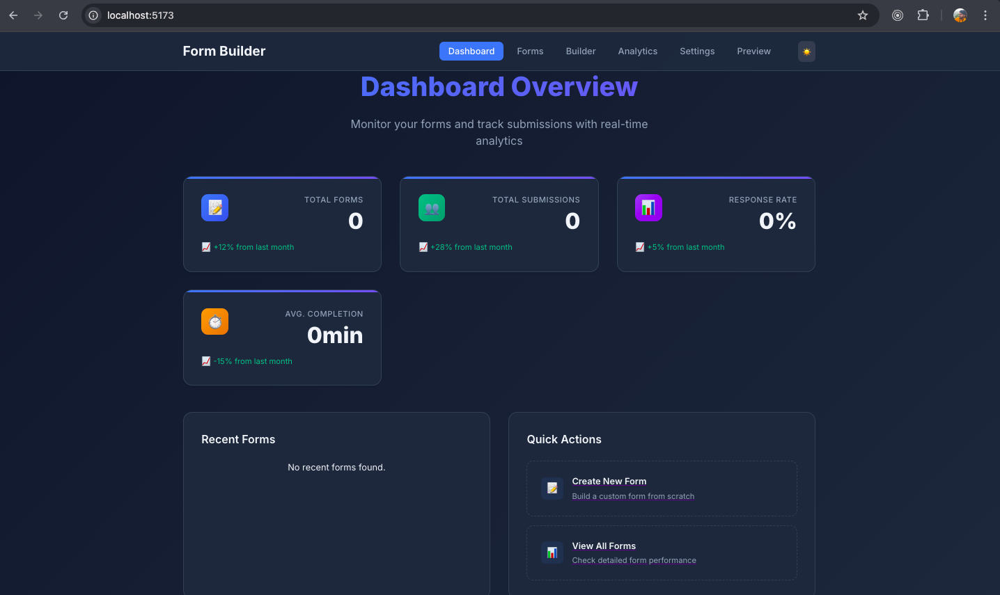

# 📝 Form Builder App

A full-stack, responsive **Form Builder Web Application** built with **ReactJS**, **TypeScript**, **Node.js**, **Express**, and **MongoDB/PostgreSQL**. This app allows users to create, manage, and analyze forms through a clean dashboard with drag-and-drop form building, analytics, and full CRUD functionality.

---

## 🔗 Features

### Frontend
- 🏠 **Dashboard:** Overview of all forms and their statuses  
- ✏️ **Form Management:** Create, edit, delete, and duplicate forms  
- 📋 **Form List View:** Displays forms with status, submission count, and creation date  
- 🛠️ **Form Builder:** Drag-and-drop interface for text, email, select, checkbox, radio, textarea, and file upload  
- ⚙️ **Field Configuration:** Set validation rules, required fields, placeholders, and options  
- 📝 **Form Settings:** Configure form title, description, custom thank-you messages, and submission limits  
- 📊 **Analytics:** Submission count, response charts, and CSV export  
- 👀 **Preview Mode:** Test forms before publishing  
- 📤 **Form Submission:** Responsive public pages with validation, file uploads, and progress indicators  

### Backend
- 🔌 **API Endpoints:** Manage forms, submissions, and file uploads  
  - `/api/forms` – CRUD operations for forms  
  - `/api/forms/:id/submissions` – Create/retrieve submissions  
  - `/api/upload` – Handles file uploads  
  - `/api/forms/:id/analytics` – Retrieve submission stats  
- 🔒 **Core Features:** Server-side validation, file storage (local/cloud), rate limiting, CORS support, and structured error handling  

---

## 🖼️ Screenshots

### 🏠 Dashboard



---

## ⚙️ Tech Stack

| Frontend        | Backend       | Database        | Others                 |
|-----------------|---------------|----------------|-----------------------|
| ReactJS, TypeScript | Node.js, Express | MongoDB/PostgreSQL | shadcn/ui, React Hook Form, Axios, Multer |

---

## 🚀 How to Run Locally

### 1. Clone the Repository
```bash
git clone <repository-url>
cd form-builder-app


Start the Application

Separate terminals:

# Backend
cd backend
npm run dev

# Frontend
cd frontend
npm run dev


